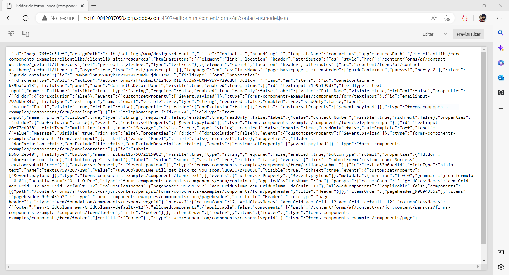

# Creación de un formulario adaptable sin encabezado con el editor de formularios adaptables {#create-a-headless-adaptive-form-using-adaptive-forms-editor}

AEM Forms as a Cloud Service ofrece un editor fácil de usar para crear formularios adaptables sin encabezado. Con más de 24 componentes principales disponibles, puede crear fácilmente un formulario arrastrando y soltando componentes en el editor. Además, el editor de reglas permite añadir validaciones a los campos del formulario.

>[!NOTE]
>
> 
>Si no tiene experiencia previa con los formularios adaptables sin encabezado, Adobe recomienda seguir el tutorial [Creación y publicación de un formulario sin encabezado con el kit de inicio](create-and-publish-a-headless-form.md) para conocer los conceptos básicos y crear de forma manual un formulario adaptable sin encabezado antes de utilizar el editor de formularios adaptables para formularios sin encabezado.

Realice los siguientes pasos para crear un formulario adaptable sin encabezado mediante el editor de formularios adaptables:

## Antes de comenzar, haga lo siguiente:

Para crear un formulario adaptable mediante el editor de formularios adaptables, es necesario lo siguiente:

**Para AEM 6.5 Forms:**

* Acceso a una instancia de autor de formularios AEM 6.5.16.0 o posterior.

* Componentes principales de Formularios adaptables

* Plantilla de componentes principales de formularios adaptables

* Una temática de formulario adaptable para la plantilla basada en componentes principales

* Añada sus usuarios al grupo [!DNL forms-users]. Los miembros del grupo [!DNL forms-users] tienen permisos para crear un formulario adaptable.

**Para AEM Forms as a Cloud Service:**

* Acceso a una [instancia de autor AEM Forms as a Cloud Service](https://experienceleague.adobe.com/docs/experience-manager-cloud-service/content/forms/setup-configure-migrate/setup-forms-cloud-service.html) o a un entorno de [SDK local de AEM Forms as a Cloud Service](https://experienceleague.adobe.com/docs/experience-manager-cloud-service/content/forms/setup-configure-migrate/setup-local-development-environment.html?lang=es).

* **Una plantilla de formulario adaptable**: Una plantilla ofrece una estructura básica y define el aspecto (diseños y estilos) de un formulario adaptable. Tiene componentes con formato previo que contienen determinadas propiedades y estructura de contenido. También ofrece opciones para definir una temática y una acción de envío. La temática define la apariencia, y la acción de envío define la acción que debe realizarse al enviar un Formulario adaptable. Por ejemplo, enviar los datos recopilados a una fuente de datos. El servicio en la nube proporciona una plantilla OOTB, denominada en blanco:

   * La plantilla `blank Adaptive Forms (Core Components)` se incluye con cada nuevo programa as a Cloud Service de AEM Forms.
   * También puede [crear una nueva plantilla de formularios adaptables (componentes principales)](https://experienceleague.adobe.com/docs/experience-manager-cloud-service/content/forms/adaptive-forms-authoring/authoring-adaptive-forms-foundation-components/create-an-adaptive-form-on-forms-cs/template-editor.html?lang=es) desde cero.

* **Una temática de formulario adaptable**: Una temática contiene detalles de estilo para los componentes y paneles. Los estilos incluyen propiedades como colores de fondo, colores de estado, transparencia, alineación y tamaño. Al aplicar una temática, el estilo especificado se refleja en los componentes correspondientes.  La plantilla `Canvas` se incluye con cada nuevo programa as a Cloud Service de AEM Forms.

* **Permisos**: añada sus usuarios al grupo [!DNL forms-users]. Los miembros del grupo [!DNL forms-users] tienen permisos para crear un formulario adaptable. Para obtener una lista detallada de los formularios y grupos de usuarios específicos, consulte [Grupos y permisos](https://experienceleague.adobe.com/docs/experience-manager-cloud-service/content/forms/setup-configure-migrate/forms-groups-privileges-tasks.html?lang=es).

## Crear un formulario adaptable  {#create-an-adaptive-form-components}

1. Inicie sesión en su instancia de autor [!DNL Experience Manager Forms]. 

1. Introduzca sus credenciales en la página de inicio de sesión de Experience Manager. Cuando haya iniciado sesión, en la esquina superior izquierda, pulse **[!UICONTROL Adobe Experience Manager]** > **[!UICONTROL Formularios]** > **[!UICONTROL Formularios y documentos]**.

1. Pulse **[!UICONTROL Crear]** > **[!UICONTROL Formularios adaptables]**. Se abre el asistente. En la pestaña Fuente, seleccione una plantilla:

   

   Al seleccionar una plantilla, se selecciona automáticamente un tema y una acción de envío especificados en la plantilla, y se habilita el botón **[!UICONTROL Crear]**. Puede ir a las pestañas **[!UICONTROL Estilo]** o **[!UICONTROL Envío]** para seleccionar un tema o acción de envío diferente. Si la plantilla seleccionada no especifica ninguna temática, el botón Crear permanece desactivado. Puede ir a la pestaña **[!UICONTROL Estilos]** para seleccionar manualmente una temática.

1. En la pestaña **[!UICONTROL Estilo]**, seleccione una temática:

   * Cuando la plantilla seleccionada especifica una temática, la temática se selecciona automáticamente en el asistente. También puede elegir una temática diferente de la pestaña Estilo.

   * Si la plantilla seleccionada no especifica ninguna temática, puede utilizar la pestaña Estilo para elegir una temática. El botón **[!UICONTROL Crear]** solo se activa después de seleccionar una temática.

1. (Opcional) En la pestaña Datos, seleccione un modelo de datos:

   * **Modelo de datos de formulario**: A [El modelo de datos de formulario](ttps://experienceleague.adobe.com/docs/experience-manager-cloud-service/content/forms/integrate/use-form-data-model/data-integration.html?lang=es) permite integrar entidades y servicios de distintas fuentes de datos en un formulario adaptable. Elija modelo de datos de formulario si el formulario adaptable que está creando implica recuperar y escribir datos desde y hacia varias fuentes de datos.

   * **Esquema JSON**: el formulario adaptable del [esquema JSON](https://experienceleague.adobe.com/docs/experience-manager-cloud-service/content/forms/adaptive-forms-authoring/authoring-adaptive-forms-foundation-components/create-an-adaptive-form-on-forms-cs/adaptive-form-json-schema-form-model.html?lang=es) permite una integración optimizada con el sistema back-end de su organización al proporcionar la posibilidad de asociar un esquema JSON, que representa la estructura de los datos que se producen o consumen. Esta asociación permite a los autores añadir contenido de forma dinámica al formulario adaptable mediante los elementos del esquema. Los elementos del esquema son fácilmente accesibles en la pestaña Objetos del modelo de datos del Explorador de contenido durante el proceso de creación y todos los campos se añaden automáticamente a cualquier formulario adaptable recién creado.

   De forma predeterminada, todos los campos del esquema JSON asociado se seleccionan automáticamente y se convierten en los correspondientes componentes de formulario adaptable, lo que optimiza el proceso de creación. El asistente ofrece la comodidad añadida de permitirle elegir selectivamente qué campos se deben incluir en el formulario adaptable mediante el uso de casillas de verificación.

1. En la pestaña **[!UICONTROL Envío]**, seleccione una acción de envío:

   * Al seleccionar una plantilla, la acción de envío especificada en la plantilla se selecciona automáticamente. Puede seleccionar una acción de envío diferente en la pestaña Envío. La pestaña **[!UICONTROL Envío]** muestra todas las acciones de envío disponibles.

   * Cuando la plantilla seleccionada no especifica una acción de envío, puede utilizar la pestaña **[!UICONTROL Envío]** para seleccionar una acción de envío

1. (Opcional) En la pestaña **[!UICONTROL Entrega]**, puede especificar una fecha de publicación o cancelación de publicación de un formulario adaptable.

1. Pulse **[!UICONTROL Crear]**. Aparece un cuadro de diálogo para especificar el título, el nombre y la ubicación para guardar el Formulario adaptable:

   * El **[!UICONTROL Título]** especifica el nombre que se muestra en el formulario. El título le ayuda a identificar el formulario en la interfaz de usuario de [!DNL Experience Manager Forms].
   * **[!UICONTROL Nombre:]** Especifica el nombre del formulario. Se crea un nodo con el nombre especificado en el repositorio. A medida que empieza a escribir un título, el valor del campo de nombre se genera automáticamente. Puede cambiar el valor sugerido. El campo de nombre solo puede incluir caracteres alfanuméricos, guiones y guiones bajos. Todas las entradas no válidas se sustituyen por guiones.
   * **[!UICONTROL Ruta:]** Especifica la ubicación en la que se va a guardar el formulario adaptable. Puede guardar el Formulario adaptable directamente en `/content/dam/formsanddocuments` o crear una carpeta como `/content/dam/formsanddocuments/adaptiveforms` para guardar un Formulario adaptable. Asegúrese de crear la carpeta antes de utilizarla en la ruta. El campo **[!UICONTROL Ruta]** no crea una carpeta automáticamente.

1. Pulse **[!UICONTROL Crear]**. Se crea un formulario adaptable que se abre en el editor de formularios adaptables. El editor muestra el contenido disponible en la plantilla.  En base al tipo de formulario adaptable, los elementos del formulario presentes en el <!--XFA form template, XML schema or --> esquema JSON o el modelo de datos de formulario asociado se muestran en la pestaña **[!UICONTROL Objetos del modelo de datos]** del **[!UICONTROL Explorador de contenido]** en la barra lateral. También puede arrastrar y soltar estos elementos para crear su formulario adaptable.

Ahora, puede arrastrar y soltar los componentes de Formularios adaptables en el contenedor de Formularios adaptables para diseñar y crear el formulario.

## Vista de la representación JSON de un formulario adaptable {#preview-form}

Seleccione el formulario adaptable y pulse **Vista previa**. Aparecerá la vista previa del formulario. Para ver la definición de formulario (JSON) del formulario, reemplace la extensión .html en la URL por .model.json

Por ejemplo, http://[author-server]:[port]/editor.html/content/forms/af/contact-us.model.json

Puede utilizar la API de Formularios adaptables sin encabezado [getForm](https://opensource.adobe.com/aem-forms-af-runtime/api/#tag/Get-Form-Definition) para obtener la definición del formulario (JSON) y utilizarla en su aplicación.

