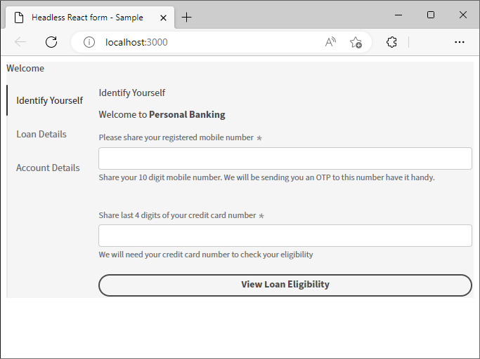
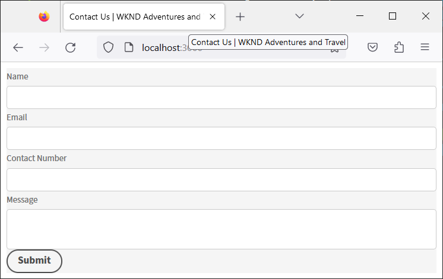

# Creación y previsualización de un formulario sin encabezado mediante una aplicación de React {#introduction}

El Starter Kit le ayuda a empezar rápidamente con una aplicación React. Puede desarrollar y utilizar formularios adaptables sin encabezado en un Angular, Vanilla JS y otros entornos de desarrollo de su elección.

Comenzar con formularios adaptables sin encabezado es bastante fácil y rápido. Clone el proyecto React ya creado, instale las dependencias y ejecute el proyecto. Tiene un formulario adaptable sin encabezado integrado en una aplicación de React en funcionamiento. Puede utilizar el proyecto react de ejemplo para crear y probar formularios adaptables sin encabezado antes de implementarlo en un entorno de producción.

Vamos a empezar:

>[!NOTE]
>
>
> Esta guía de introducción utiliza una aplicación de React. Puede utilizar la tecnología o el lenguaje de programación que prefiera para utilizar formularios adaptables sin encabezado.

## Antes de comenzar {#pre-requisites}

Para crear y ejecutar una aplicación de React, debe tener instalado lo siguiente en el equipo:

* Instale el [última versión de Git](https://git-scm.com/downloads). Si es nuevo en Git, consulte [Instalación de Git](https://git-scm.com/book/en/v2/Getting-Started-Installing-Git).

* Instalar [Node.js 16.13.0 o posterior](https://nodejs.org/es/download/). Si no tiene experiencia previa con Node.js, consulte [Cómo instalar Node.js](https://nodejs.dev/en/learn/how-to-install-nodejs).

## Introducción

Una vez que cumpla los requisitos, realice los siguientes pasos para empezar:

1. [Configuración del kit de inicio de formularios adaptables sin encabezado](#setup)

1. [Vista previa del formulario adaptable sin encabezado incluido en el Starter Kit](#preview)

1. [Crear y procesar su propio formulario adaptable sin encabezado](#custom)


## 1. Configurar el kit de inicio de formularios adaptables sin encabezado {#install}

El Starter Kit es una aplicación de React con un formulario adaptable sin encabezado de ejemplo y las bibliotecas correspondientes. Utilice el kit para desarrollar y probar sus formularios adaptables sin encabezado y los componentes de React correspondientes. Ejecute los siguientes comandos para configurar el Starter Kit de formularios adaptables sin encabezado:

1. Abra el símbolo del sistema y ejecute el siguiente comando:

   ```shell
   git clone https://github.com/adobe/react-starter-kit-aem-headless-forms
   ```

   El comando crea un directorio llamado **react-starter-kit-aem-headless-forms** en su ubicación actual y clona la aplicación de inicio React de formularios adaptables sin encabezado en ella. Junto con las configuraciones y la lista de dependencias necesarias para procesar el formulario, el directorio incluye el siguiente contenido importante:

   * **Formulario de ejemplo**: el Starter Kit incluye un formulario de solicitud de préstamo de ejemplo. Para ver el formulario (definición de formulario) incluido con la aplicación, abra el `/react-starter-kit-aem-headless-forms/form-definations/form-model.json` archivo.
   * **Componentes React de muestra**: el Starter Kit incluye componentes react de muestra para texto enriquecido y Slider. Esta guía le ayuda a crear sus propios componentes personalizados con estos componentes Texto enriquecido y Regulador.
   * **Mappings.ts**: el archivo mappings.ts le ayuda a asignar componentes personalizados con campos de formulario. Por ejemplo, asigne un campo de salto numérico con el componente de clasificación.
   * **Configuraciones del entorno**: las configuraciones de entorno le permiten elegir procesar un formulario incluido en el Starter Kit o recuperar un formulario de un servidor de AEM Forms.

   

   >[!NOTE]
   >
   > 
   > Los ejemplos de los documentos se basan en VSCode. Puede utilizar cualquier editor de código de texto sin formato.


1. Vaya a **react-starter-kit-aem-headless-forms** y ejecute el siguiente comando para instalar las dependencias:

   ```shell
   npm install
   ```

   El comando descarga todos los paquetes y bibliotecas necesarios para ejecutar y crear la aplicación, como las bibliotecas de formularios adaptables sin encabezado (@aemforms/af-react-renderer, @aemforms/af-react-components, @adobe/react-spectrum), ejecuta las validaciones y conserva los datos de las instancias del formulario.

   


## 2. Previsualizar el formulario adaptable sin encabezado {#preview}

Después de configurar el Starter Kit, puede obtener una vista previa del formulario adaptable sin encabezado de ejemplo y reemplazarlo por su propio formulario personalizado. También puede configurar el Starter Kit para recuperar un formulario de un servidor de AEM Forms. Para obtener una vista previa del formulario

1. Cambie el nombre del `env_template` archivo a `.env` archivo. Asegúrese también de que la opción USE_LOCAL_JSON está establecida en true.

   

   <!-- The options in the .env file help you configure source of the forms definantion (.JSON):
    *  To source forms definantion (.JSON) from an AEM Server, set USE_LOCAL_JSON option to false, use the AEM_URL option to specify URL  of your AEM Server, and set the AEM_FORM_PATH option to path of your adaptive form.
    *  To source forms definantion (.JSON) form-model.json file included in the starter-kit, set USE_LOCAL_JSON option to false. -->

1. Utilice el siguiente comando para ejecutar la aplicación:

   ```shell
     npm start
   ```


   Este comando inicia un servidor de desarrollo local y abre el formulario adaptable sin encabezado de ejemplo, incluido en la aplicación de inicio, en el explorador web predeterminado.

   

   ¡Voila! Todos están configurados para empezar a desarrollar un formulario adaptable sin encabezado personalizado.

   <!--  As you know, in a headless form the form data and logic are separate from the presentation layer and can be used by any client that can make HTTP requests, such as a mobile app, a static site, or a different web application. The form is often managed and stored on a server, which serves as the backend for the form. The client sends requests to the server to retrieve the form, submit data, and receive updated form data. This allows for greater flexibility and integration with different technologies. You can store and retrive a Headless adaptive form on an AEM Server  -->

## 3. Crear y procesar su propio formulario adaptable sin encabezado{#custom}

Un formulario adaptable sin encabezado representa el formulario y sus componentes, como campos y botones, en formato JSON (notación de objetos JavaScript). La ventaja de utilizar el formato JSON es que puede analizarse y utilizarse fácilmente en varios lenguajes de programación, lo que lo convierte en una forma cómoda de intercambiar datos de formulario entre sistemas. Para ver el formulario adaptable sin encabezado de ejemplo incluido con la aplicación, abra el `/react-starter-kit-aem-headless-forms/form-definations/form-model.json` archivo.

Vamos a crear un formulario de contacto con nosotros con cuatro campos: &quot;Nombre&quot;, &quot;Correo electrónico&quot;, &quot;Número de contacto&quot; y &quot;Mensaje&quot;. Los campos se definen como objetos (elementos) dentro del JSON, y cada objeto (elemento) tiene propiedades como tipo, etiqueta, nombre y obligatorio. El formulario también tiene un botón de tipo &quot;enviar&quot;. Este es un archivo JSON para el formulario.


```JSON
{
  "afModelDefinition": {
    "adaptiveform": "0.10.0",
    "items": [
      {
        "fieldType": "text-input",
        "label": {
          "value": "Name"
        },
        "name": "name"
      },
      {
        "fieldType": "text-input",
        "format": "email",
        "label": {
          "value": "Email"
        },
        "name": "email"
      },
      {
        "fieldType": "text-input",
        "format": "phone",
        "pattern": "[0-9]{10}",
        "label": {
          "value": "Contact Number"
        },
        "name": "Phone"
      },
      {
        "fieldType": "multiline-input",
        "label": {
          "value":"Message"
        },
        "name": "message"
      },
      {
        "fieldType": "button",
        "label":{
          "value": "Submit"
        },
        "name":"submit",
        "events":{
          "click": "submitForm()"
        }
      }
    ],
    "action": "https://eozrmb1rwsmofct.m.pipedream.net",
    "description": "Contact Us",
    "title": "Contact Us",
    "metadata": {
      "grammar": "json-formula-1.0.0",
      "version": "1.0.0"
    }
  }
}
```

>[!NOTE]
>
> * El atributo &quot;afModelDefinition&quot; solo es necesario para las aplicaciones de React y no forma parte de la definición del formulario.
> * Puede crear a mano el formulario JSON o utilizar el [AEM Editor de formularios adaptables (editor WYSIWYG de formularios adaptables)](create-a-headless-adaptive-form.md) para crear y enviar el formulario JSON. En un entorno de producción, se utiliza AEM Forms para enviar el formulario JSON, que se ampliará más adelante.
> * El tutorial utiliza el https://pipedream.com/ para probar los envíos de formularios. Utiliza puntos de conexión propios o de terceros aprobados por su organización para recibir los datos de un formulario adaptable sin encabezado.


Para procesar el formulario, reemplace el formulario adaptable de ejemplo JSON de `/react-starter-kit-aem-headless-forms/form-definations/form-model.json` Con el JSON anterior, guarde el archivo, espere a que el starter-kit se compile y actualice el formulario.


<!-- Your form is ready. Let's add some validations and make "Name", "Email", and "Message" fields mandatory. -->

Ha procesado correctamente el formulario adaptable sin encabezado.


## Bonificación

Definamos el título de la página web que aloja el formulario como `Contact Us | WKND Adventures and Travel`. Para cambiar el título, abra el _react-starter-kit-aem-headless-forms/public/index.html_ para editar y definir el título.




## Siguiente paso

De forma predeterminada, el Starter Kit utiliza [Espectro de Adobe](https://spectrum.adobe.com/) componentes para procesar el formulario. Puede utilizar crear y utilizar sus propios componentes o componentes de terceros. Por ejemplo, con la interfaz de usuario de Material de Google o la interfaz de usuario de Chakra.

Vamos a... [usar la interfaz de usuario de Google Material](use-google-material-ui-react-components-to-render-a-headless-form.md) para procesar nuestro formulario de Contacto.


