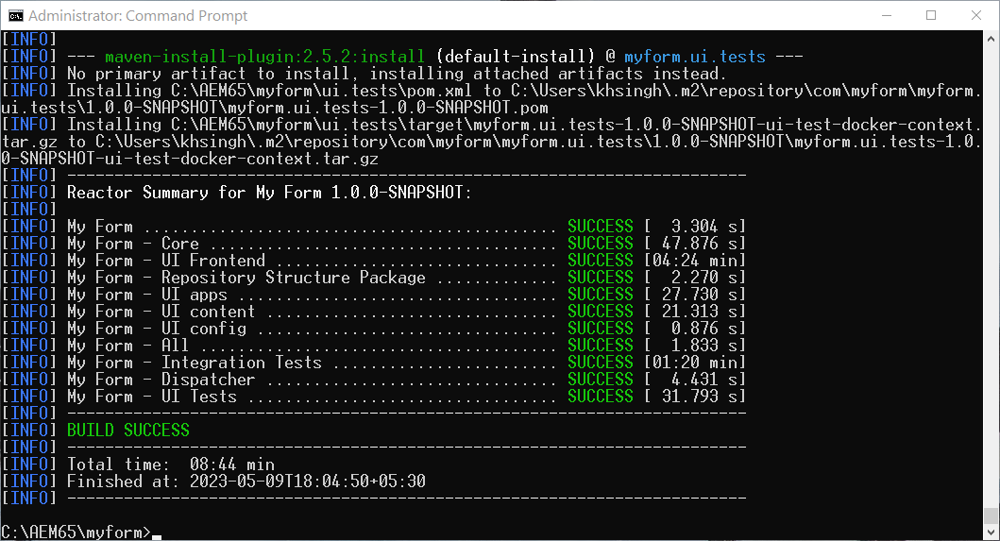

# Habilitar Forms AEM adaptable sin encabezado en Forms de 6.5 {#enable-headless-adaptive-forms-on-aem-65-forms}

Para habilitar Forms AEM adaptable sin encabezado en el entorno de Forms AEM de 6.5, configure un proyecto basado en tipo de archivo 41 o posterior e impleméntelo en todas las instancias de autor y publicación.

AEM AEM Al implementar el proyecto basado en Arquetipo de archivo 41 o posterior en las instancias de Forms de la versión 6.5 de la, puede [crear componentes principales basados en Forms adaptable](create-a-headless-adaptive-form.md). Forms Estos formularios se representan en formato JSON y se utilizan como formularios adaptables con encabezado y sin encabezado, lo que permite una mayor flexibilidad y personalización en una amplia gama de canales, incluidas aplicaciones móviles, web y nativas.

## Requisitos previos {#prerequisites}

Antes de habilitar Forms AEM adaptable sin encabezado en el entorno de Forms de 6.5,

* [AEM Actualización a Paquete de servicio 16 (6.5.16.0) o posterior de Forms de 6.5](https://experienceleague.adobe.com/docs/experience-manager-65/release-notes/aem-forms-current-service-pack-installation-instructions.html).

* Instale la última versión de [Apache Maven](https://maven.apache.org/download.cgi).

* Instale un editor de texto sin formato. Por ejemplo, Microsoft Visual Studio Code.

## AEM Crear e implementar el último proyecto basado en Arquetipo de archivo de

AEM Para crear un tipo de archivo 41 o un tipo de archivo [posterior](https://github.com/adobe/aem-project-archetype) proyecto basado en e implementarlo en todas las instancias de autor y publicación:

1. AEM Inicie sesión en el equipo, aloje y ejecute la instancia de Forms de.5 como administrador.
1. Abra el símbolo de comando o el terminal.
1. AEM Ejecute el siguiente comando para crear proyecto basado en el tipo de archivo 41:

   * Microsoft Windows

   ```Shell
      mvn -B org.apache.maven.plugins:maven-archetype-plugin:3.2.1:generate ^
      -D archetypeGroupId=com.adobe.aem ^
      -D archetypeArtifactId=aem-project-archetype ^
      -D archetypeVersion=41 ^
      -D appTitle="My Form" ^
      -D appId="myform" ^
      -D groupId="com.myform" ^
      -D includeFormsenrollment="y" ^
      -D aemVersion="6.5.15" 
   ```

   * Linux o APPLE MACOS

   ```Shell
      mvn -B org.apache.maven.plugins:maven-archetype-plugin:3.2.1:generate \
      -D archetypeGroupId=com.adobe.aem \
      -D archetypeArtifactId=aem-project-archetype \
      -D archetypeVersion=41 \
      -D appTitle="My Form" \
      -D appId="myform" \
      -D groupId="com.myform" \
      -D includeFormsenrollment="y" \
      -D aemVersion="6.5.15" 
   ```

   Cuando ejecute el comando anterior, asegúrese de tener en cuenta los siguientes puntos:

   * Actualice el comando para reflejar los valores específicos de su entorno, incluidos appTitle, appId y groupId. Además, establezca los valores de includeFormsenrollment en &#39;y&#39;. Si utiliza el portal de Forms, configure las _includeExamples=y_ para incluir los componentes principales del portal de Forms en el proyecto.

   * No cambie &quot;aemVersion&quot; de 6.5.15.0 a nada más.

1. AEM (Solo para proyectos basados en la versión 41 del tipo de archivo) Una vez creado el proyecto del tipo de archivo, habilite las temáticas para componentes principales basados en Forms adaptable. Para habilitar las temáticas:

   1. Abra el [AEM Carpeta de proyecto de tipo de archivo]/ui.apps/src/main/content/jcr_root/apps/__appId__/components/adaptiveForm/page/customheaderlibs.html para editar:

   1. Agregue el siguiente código en la línea 21:

      ```XML
      <sly data-sly-use.clientlib="core/wcm/components/commons/v1/templates/clientlib.html"
      data-sly-use.formstructparser="com.adobe.cq.forms.core.components.models.form.FormStructureParser"
      data-sly-test.themeClientLibRef="${formstructparser.themeClientLibRefFromFormContainer}">
      <sly data-sly-test="${themeClientLibRef}" data-sly-call="${clientlib.css @ categories=themeClientLibRef}"/>
      </sly>
      ```

      

   1. Guarde y cierre el archivo.

1. Actualizar el proyecto para incluir la última versión de los componentes principales de Forms:

   1. Abra el [AEM Carpeta de proyecto de tipo de archivo]/pom.xml para editar.
   1. Establecer versión de `core.forms.components.version` y `core.forms.components.af.version` hasta [Últimos componentes principales de Forms](https://github.com/adobe/aem-core-forms-components/tree/release/650) versión.

      

   1. Guarde y cierre el archivo.


1. AEM Una vez que el proyecto de tipo de archivo se haya creado correctamente, cree el paquete de implementación para su entorno. Para crear el paquete:

   1. AEM Navegue hasta el directorio raíz del proyecto de tipo de archivo de.


   1. AEM Ejecute el siguiente comando para crear el proyecto de tipo de archivo de para su entorno:

      ```Shell
      mvn clean install
      ```

      


   AEM AEM Una vez generado correctamente el proyecto de tipo de archivo, se genera un paquete de. Puede encontrar el paquete en [AEM Carpeta de proyecto de tipo de archivo]\all\target\[appid].all-[version].zip

1. Utilice el [Administrador de paquetes](https://experienceleague.adobe.com/docs/experience-manager-65/administering/contentmanagement/package-manager.html?lang=es) para implementar el [AEM Carpeta de proyecto de tipo de archivo]\all\target\[appid].all-[version]Paquete .zip en todas las instancias de autor y publicación.

>[!NOTE]
>
>
>
>Si tiene dificultades para acceder al cuadro de diálogo de inicio de sesión en una instancia de publicación para instalar el paquete a través del Administrador de paquetes, intente iniciar sesión a través de la siguiente URL: http://[URL del servidor de publicación]:[PUERTO]/system/console. Esto le permite acceder al inicio de sesión en la instancia de publicación, lo que le permite continuar con el proceso de instalación.


Los componentes principales están habilitados para su entorno. Se implementan en el entorno una plantilla de formulario adaptable basada en componentes principales en blanco y una temática de lienzo 3.0 que le permiten [crear componentes principales basados en Forms adaptable](create-a-headless-adaptive-form.md).

## Preguntas frecuentes

### ¿Qué son los componentes principales?

Los [componentes principales](https://experienceleague.adobe.com/docs/experience-manager-core-components/using/introduction.html?lang=es) son un conjunto de componentes estandarizados de la administración de contenido web (WCM) para AEM con el objetivo de acelerar el tiempo de desarrollo y reducir el coste de mantenimiento de sus sitios web.

### ¿Qué es todo lo que se añade en la activación de componentes principales?


Cuando los componentes principales de formularios adaptables se habilitan para su entorno, se agrega a este una plantilla de formulario adaptable basada en componentes principales en blanco y una temática de Lienzo 3.0. Tras habilitar los componentes principales de formularios adaptables para su entorno, puede:

* Crear componentes principales basados en formularios adaptables.
* Crear componentes principales basados en plantillas de formulario adaptable.
* Crear temáticas personalizadas para componentes principales basadas en plantillas de formulario adaptable.
* Proporcione representaciones JSON de un formulario adaptable basado en componentes principales a canales como mobile, web, apps nativas y servicios que requieren la representación sin encabezado de un formulario.
