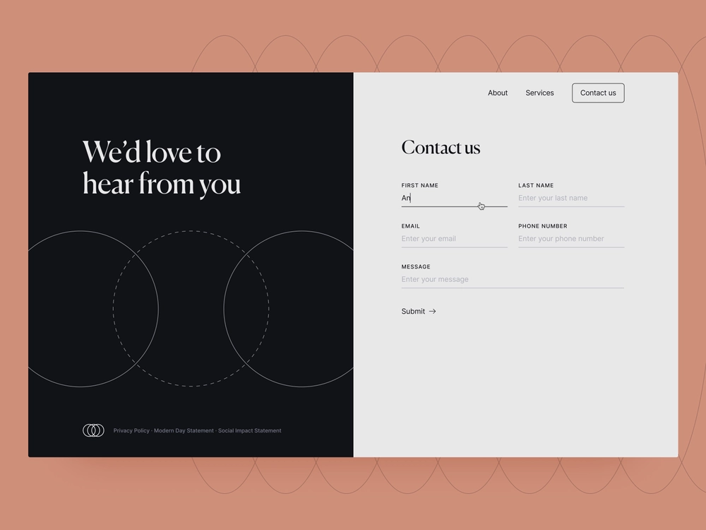

# Introducción a Formularios adaptables sin encabezado

Este tutorial proporciona un marco de trabajo completo para crear un formulario adaptable sin encabezado. El tutorial está organizado en un caso de uso y en varias guías. Cada guía le ayuda a aprender y agregar nuevas funciones al formulario adaptable que se cree en este tutorial. Después de cada guía, tendrá un formulario adaptable operativo. Al final de este tutorial, podrá hacer lo siguiente:

* Crear un formulario adaptable sin encabezado
* Agregar reglas empresariales al formulario
* Usar la interfaz de usuario de Google Material para aplicar estilo al formulario
* Rellenar previamente el formulario 
* Incrustar el formulario en una página web

También generará una comprensión de la arquitectura, los artefactos disponibles y la estructura JSON de los formularios adaptables sin encabezado.

**El recorrido comienza con el aprendizaje del caso de uso**:

Raya Tan, miembro del departamento de asuntos exteriores de un país conocido por su belleza natural y su próspera economía turística, supervisa la distribución de formularios de visado a los turistas. Estos formularios están disponibles en el sitio web del departamento, las aplicaciones móviles nativas y en formato PDF, con múltiples opciones de idioma para que los turistas elijan. Sin embargo, administrar y escalar estos formularios en diferentes plataformas y tecnologías puede ser un desafío.

Con el fin de mejorar la eficiencia y la flexibilidad de su proceso de solicitud de visados, el Departamento de Asuntos Exteriores ha decidido adoptar un enfoque de formularios adaptables sin encabezado. Esta arquitectura disociada separa el front-end del back-end, lo que permite una mayor personalización y escalabilidad. El departamento tiene previsto utilizar los componentes de React de la interfaz de usuario de Google Material para mejorar la experiencia del usuario con los formularios, mientras utiliza funciones back-end como firmas digitales, integración de datos, administración de procesos empresariales, documentos de registro y análisis de uso.

La forma más popular entre los turistas es el formulario “Contacto”, que se utiliza para hacer diversas preguntas y consultas. Como tal, el departamento de asuntos exteriores ha elegido empezar a implementar el método de formularios adaptables sin encabezado con este formulario. Este tutorial le guiará a través del proceso de creación del formulario de Contacto mediante esta nueva arquitectura. El resultado final tendrá este aspecto:

