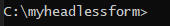
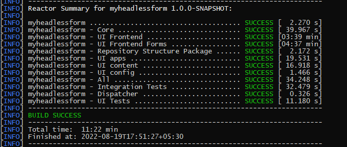
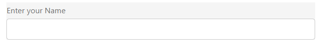
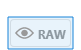
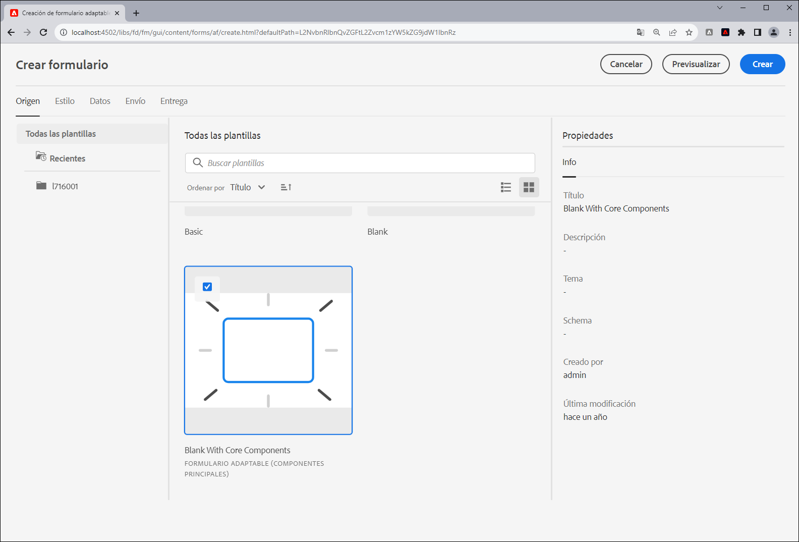

# Crear su primer formulario adaptable sin encabezado

Puede utilizar formularios adaptables sin encabezado de Adobe Experience Manager para generar aplicaciones de formularios utilizando IU front-end como React y emplear el SDK web de formularios para capacidades como administración de estado, validación e integraciones con otros puntos de contacto.

Por ejemplo, la organización We.Org quiere digitalizar su recorrido de inscripción de clientes. Sus desarrolladores son expertos en el uso de Angular para generar soluciones front-end. Buscan la creación de un front-end personalizado al descargar la validación de formularios y las firmas electrónicas a soluciones especializadas.

Los formularios adaptables sin encabezado de Adobe Experience Manager proporcionan a estas organizaciones la libertad de generar formularios utilizando su experiencia existente en idiomas de front-end, a la vez que proporcionan asistencia para utilizar funciones de back-end para crear experiencias de formularios de clase empresarial.

<!-- >>[!VIDEO](https://video.tv.adobe.com/v/341011/) -->

<!--   -->

## Antes de comenzar

* Configure las variables de [entorno de desarrollo](setup-development-environment.md) para permitirle crear y probar un formulario adaptable sin encabezado en su equipo local.
* El software siguiente debe estar instalado en el equipo de desarrollo local:
   * [Kit de desarrollo de Java 11](https://experience.adobe.com/#/downloads/content/software-distribution/en/general.html?1_group.propertyvalues.property=.%2Fjcr%3Acontent%2Fmetadata%2Fdc%3AsoftwareType&amp;1_group.propertyvalues.operation=equals&amp;1_group.propertyvalues.0_values=software-type%3Atooling&amp;fulltext=Oracle%7E+JDK%7E+11%7E&amp;orderby=%40jcr%3Acontent%2Fjcr%3AlastModified&amp;orderby.sort=desc&amp;layout=list&amp;p.offset=0&amp;p.limit=14)
   * [Última versión de Git](https://git-scm.com/downloads). Si no tiene experiencia previa con Git, consulte [Instalación de Git](https://git-scm.com/book/en/v2/Getting-Started-Installing-Git).
   * [Node.js 16.13.0 o posterior](https://nodejs.org/es/download/). Si no tiene experiencia previa con Node.js, consulte [Cómo instalar Node.js](https://nodejs.dev/en/learn/how-to-install-nodejs).
   * [Maven 3.6 o posterior](https://maven.apache.org/download.cgi). Si no tiene experiencia previa con Maven, consulte [Instalación de Apache Maven](https://maven.apache.org/install.html?lang=es).


## Utilizar el proyecto de arquetipo para crear un formulario adaptable sin encabezado

El tipo de archivo del proyecto es una plantilla basada en Maven. Crea un proyecto mínimo basado en las prácticas recomendadas para empezar a utilizar formularios adaptables sin encabezado. También incluye la funcionalidad de formularios adaptables sin encabezado para los entornos de desarrollo de Forms as a Cloud Service y local. Es obligatorio crear e implementar el proyecto basado en el arquetipo 37 o posterior durante la fase beta. Después de la versión beta, el proyecto solo es necesario para las personalizaciones.

Siga estos pasos para crear y procesar su primer formulario adaptable sin encabezado:

1. [Crear e implementar un proyecto basado en el arquetipo de AEM](#create-an-archetype-based-project)
1. [Implementar el proyecto en el SDK de AEM](#deploy-the-project-to-a-local-development-environment)
1. [Crear el esquema JSON de un formulario adaptable sin encabezado y cargarlo en la instancia del SDK de AEM](#create-add-json-representation-of-headless-adaptive-forms)
1. [Crear un formulario adaptable basado en la plantilla En blanco con componentes principales](#create-adaptive-form-with-blank-with-core-components-template)


### 1. Crear e implementar un proyecto basado en el arquetipo de AEM {#create-an-archetype-based-project}

Según el sistema operativo, ejecute el siguiente comando para crear un proyecto de Experience Manager Forms as a Cloud Service. Utilice la versión 37 o posterior del arquetipo. Consulte [Documentación del arquetipo](https://experienceleague.adobe.com/docs/experience-manager-core-components/using/developing/archetype/overview.html?lang=es) para encontrar la última versión del arquetipo.

**Microsoft Windows**

1. Abra el símbolo del sistema con privilegios administrativos (ejecute el símbolo del sistema o bash shell como administrador)
1. Ejecute el siguiente comando:

   ```shell
     mvn -B org.apache.maven.plugins:maven-archetype-plugin:3.2.1:generate ^
     -D archetypeGroupId=com.adobe.aem ^
     -D archetypeArtifactId=aem-project-archetype ^
     -D archetypeVersion=37 ^
     -D appTitle=myheadlessform ^
     -D appId=myheadlessform ^
     -D groupId=com.myheadlessform ^
     -D includeFormsenrollment="y" ^
     -D includeFormsheadless="y" 
   ```

   * Establezca `appTitle` para definir el título y los grupos de componentes.
   * Establezca `appId` para definir el artifactId de Maven, los nombres de carpetas de componentes, configuración y contenido y los nombres de bibliotecas de cliente.
   * Establezca `groupId` para definir el groupId de Maven y el Paquete de origen de Java.
   * Utilice la opción `includeFormsenrollment=y` para incluir configuraciones, temáticas, plantillas, componentes principales y dependencias específicos para formularios, que son necesarios para crear formularios adaptables.
   * Utilice la opción `includeFormsheadless=y` para incluir los componentes principales y las dependencias de Forms necesarios para incluir la funcionalidad de Formularios adaptables sin encabezado. Al habilitar esta opción, se incluyen las siguientes opciones:
      * La plantilla **En blanco con componentes principales** con [componentes principales](https://experienceleague.adobe.com/docs/experience-manager-core-components/using/introduction.html?lang=es).
      * Un módulo de React de front-end, `ui.frontend.react.forms.af`. Le ayuda a procesar formularios adaptables sin encabezado en una aplicación de react.


**Apple macOS o Linux**:

1. Abra el terminal como usuario raíz. Permite ejecutar comandos con privilegios administrativos. También puede utilizar `sudo root` después de abrir la ventana de terminal para ejecutar comandos con privilegios administrativos.
1. Ejecute el siguiente comando:

   ```shell
     mvn -B org.apache.maven.plugins:maven-archetype-plugin:3.2.1:generate \
     -D archetypeGroupId=com.adobe.aem \
     -D archetypeArtifactId=aem-project-archetype \
     -D archetypeVersion=37 \
     -D appTitle=myheadlessform \
     -D appId=myheadlessform \
     -D groupId=com.myheadlessform \
     -D includeFormsenrollment="y" \
     -D includeFormsheadless="y"  
   ```

   * Establezca `appTitle` para definir el título y los grupos de componentes.
   * Establezca `appId` para definir el artifactId de Maven, los nombres de carpetas de componentes, configuración y contenido, y los nombres de bibliotecas de cliente.
   * Establezca `groupId` para definir el groupId de Maven y el paquete de origen de Java.
   * Utilice la opción `includeFormsenrollment=y` para incluir configuraciones, temáticas, plantillas, componentes principales y dependencias específicos para formularios, que son necesarios para crear formularios adaptables.
   * Utilice la opción `includeFormsheadless=y` para incluir los componentes principales y las dependencias de Forms necesarios para incluir la funcionalidad de Formularios adaptables sin encabezado. Al habilitar esta opción, se incluyen las siguientes opciones:
      * La plantilla **En blanco con componentes principales** con [componentes principales](https://experienceleague.adobe.com/docs/experience-manager-core-components/using/introduction.html?lang=es).
      * Un módulo reacts de front-end, `ui.frontend.react.forms.af`. Le ayuda a procesar formularios adaptables sin encabezado en una aplicación de react.

Al finalizar correctamente el comando, se creará una carpeta de proyecto con el nombre especificado en el `appID`. Por ejemplo, si utiliza `appID` con el valor `myheadlessform`, se creará una carpeta denominada `myheadlessform`. Contiene el proyecto basado en el arquetipo.


### 2. Implementar el proyecto en el SDK de AEM {#deploy-the-project-to-a-local-development-environment}

Al implementar el proyecto en la instancia del SDK de AEM, se agrega la funcionalidad de Formularios adaptables sin encabezado, la variable **En blanco con componentes principales** y otros recursos incluidos en el proyecto a su entorno de desarrollo. <!-- Deploy the project to your local development environment to locally create Headless Adaptive Forms. or deploy directly to your Forms as a Cloud Service environment. !--> Para implementar en la instancia de SDK de AEM, haga lo siguiente:

1. Abra el símbolo del sistema. Si está en Windows, abra el símbolo del sistema con privilegios administrativos (ejecute el símbolo del sistema o [shell de Git bash](https://khushwantsehgal.wordpress.com/2022/06/29/check-if-git-bash-is-running-in-administrator-mode/) como administrador).

1. Vaya al directorio del proyecto creado en el paso anterior. Por ejemplo, `/myheadlessform`

   

1. Ejecute el siguiente comando:

   ```shell
   mvn -PautoInstallPackage clean install
   ```

   Espere al mensaje “Generar éxito”.
   

   Puede llevar mucho tiempo resolver las dependencias e implementar el proyecto. Si se produce un error al implementar el proyecto, consulte el artículo [resolución de problemas](troubleshooting.md) para problemas comunes y su resolución.


<!-- *  To learn how to deploy code to AEM as a Cloud Service, see the video in [Deploying to AEM as a Cloud Service]https://experienceleague.adobe.com/docs/experience-manager-cloud-service/content/implementing/deploying/overview.html?lang=en#coding-against-the-right-aem-version) article : -->


### 3. Crear el esquema JSON de un formulario adaptable sin encabezado y cargarlo en la instancia del SDK de AEM {#create-add-json-representation-of-headless-adaptive-forms}

Los formularios adaptables sin encabezado se representan como un archivo JSON. Puede obtener un formulario de ejemplo de [Storybook](https://opensource.adobe.com/aem-forms-af-runtime/storybook/?path=/story/reference-examples--contact) o utilizar el formulario de ejemplo que se incluye en el Proyecto de arquetipo en `[Archetype Project]\ui.content\src\main\content\jcr_root\content\dam\myheadlessform\af_model_sample.json`. Este documento utiliza el formulario [introducción](https://opensource.adobe.com/aem-forms-af-runtime/storybook/?path=/story/reference-examples--introduction) de Storybook. Es un formulario de un solo campo para ayudarle a empezar rápidamente con Formularios adaptables sin encabezado. <!-- The [specifications](/help/assets/Headless-Adaptive-Form-Specification.pdf) document provides detailed information about various components, rules, and constraints for Headless Adaptive Forms -->

Para crear y cargar el esquema, haga lo siguiente:

1. Cree un archivo sin formato con la extensión `.json`. Por ejemplo, `myfirstform.json`. Puede crear el archivo en cualquier lugar del sistema de archivos o en su proyecto basado en el arquetipo de AEM en `\<project-name>\ui.content\src\main\content\jcr_root\content\dam\myheadlessform\<formname>.json`
1. Agregue el siguiente contenido JSON al archivo `.json` y guárdelo:

   ```JSON
   {
     "adaptiveform": "0.10.0",
     "items": [
       {
         "fieldType": "text-input",
         "label": {
           "value": "Enter your Name"
         },
         "name": "textInput"
       }
     ],
     "metadata": {
       "grammar": "json-formula-1.0.0",
       "version": "1.0.0"
     }
   }
   ```

   Añade un solo campo al formulario:

   

1. Inicie sesión en su [instancia del SDK de AEM local](setup-development-environment.md#setup-author-instance)
1. Vaya a Adobe Experience Manager > Formularios > Formularios y documentos. Pulse Crear > Cargar archivo.
1. Seleccione `.json` creado en el paso 2 y cárguelo. Está listo para crear el formulario adaptable sin encabezado. Si guarda el archivo .json en el proyecto basado en el arquetipo de AEM en `\<project-name>\ui.content\src\main\content\jcr_root\content\dam\myheadlessform\<formname>.json`. Puede utilizar `mvn -PautoInstallPackage clean install` para implementar el proyecto en el SDK de AEM y `<formname>.json` junto con él.

Si se produce un error al cargar `.json`, asegúrese de que el [proyecto de arquetipo de AEM se haya implementado correctamente](#deploy-the-project-to-a-local-development-environment).

<!-- 1. Open the [contact form](https://opensource.adobe.com/aem-forms-af-runtime/storybook/?path=/story/reference-examples--contact) and tap the [](faq.md#storybook-example) icon on bottom-right side of the Storybook page to view the source code of the headless . 

You can use [Adaptive Forms builder extension for Visual Studio Code](/help/setup-development-environment.md#microsot-visual-studio-code-extension-for-headless-adaptive-forms) to build a JSON schema of your Headless Adaptive Forms. 

You can see [Storybook](https://opensource.adobe.com/aem-forms-af-runtime/storybook/?path=/story/reference-examples--introduction) for sample JSON schemas and list of components, attributes, and properties. You can also see the [specifications document](/help/assets/Headless-Adaptive-Form-Specification.pdf) for detailed information on all the components, constraints, and methods available to define Headless Adaptive Forms.

File extension of a JSON schema of Headless Adaptive Forms is .json. For example, formname.json. Create or add the file to your AEM Archetype based project. For example, `\myheadlessform\ui.content\src\main\content\jcr_root\content\dam\myheadlessform\home-loan.json` -> 

### 3. Deploy the project to a local development environment {#deploy-the-project-to-a-local-development-environment}

You can deploy the project to local development environment. It adds Headless Adaptive Forms functionality, the **Blank with core components** template, JSON schema of form, and other resources included in the project to your development environment. <!-- Deploy the project to your local development environment to locally create Headless Adaptive Forms. or deploy directly to your Forms as a Cloud Service environment. To deploy to your local development environment, use the following command: 

    `mvn -PautoInstallPackage clean install`

If you are on Windows, run the above with Administrative privileges (Run command prompt or [bash shell as an administrator](https://khushwantsehgal.wordpress.com/2022/06/29/check-if-git-bash-is-running-in-administrator-mode/)). For the complete list of commands, see [Building and Installing](https://experienceleague.adobe.com/docs/experience-manager-core-components/using/developing/archetype/using.html?lang=en#building-and-installing).
    
<!-- *  To learn how to deploy code to AEM as a Cloud Service, see the video in [Deploying to AEM as a Cloud Service]https://experienceleague.adobe.com/docs/experience-manager-cloud-service/content/implementing/deploying/overview.html?lang=en#coding-against-the-right-aem-version) article : -->

### 4. Crear un formulario adaptable basado en la plantilla En blanco con componentes principales {#create-adaptive-form-with-blank-with-core-components-template}

1. Inicie sesión en la [instancia del SDK de AEM](http://localhost:4502/).

1. Vaya a Adobe Experience Manager > Formularios > Formularios y documentos.

1. Pulse Crear y seleccione Formulario adaptable. Seleccione la plantilla **En blanco con componentes principales** y pulse Crear.

   

1. Especifique los valores para los siguientes campos de propiedad. Los campos Título y Nombre son obligatorios:

   * **Título** especifica el nombre que se muestra en el formulario. El título le ayuda a identificar el formulario en la interfaz de usuario de Experience Manager Forms.
   * **Nombre**:especifica el nombre del formulario. Se crea un nodo con el nombre especificado en el repositorio. A medida que empieza a escribir un título, el valor del campo de nombre se genera automáticamente. Puede cambiar el valor sugerido. El campo de nombre solo puede incluir caracteres alfanuméricos, guiones y guiones bajos. Todas las entradas no válidas se sustituyen por guiones.

1. Pulse Crear. Se crea un formulario adaptable.

Si no ve la plantilla **en blanco con los componentes principales**, asegúrese de que el [proyecto basado en el arquetipo AEM se haya implementado correctamente](#deploy-the-project-to-a-local-development-environment).

### 5. Configurar el formulario adaptable para utilizar el esquema JSON {#configure-adaptive-form-to-use-the-JSON-representation}

El formulario adaptable creado en el paso anterior está en blanco. Configure el formulario adaptable para utilizar el esquema JSON:

1. Inicie sesión en la [instancia del SDK de AEM](http://localhost:4502/).

1. Vaya a Adobe Experience Manager > Formularios > Formularios y documentos. Seleccione el formulario adaptable creado en el paso anterior y pulse Editar. El formulario adaptable se abre en el editor.

1. Pulse el componente Contenedor de formularios adaptables y luego pulse Propiedades. Muestra las propiedades del explorador en la barra lateral.

1. En el explorador de propiedades, expanda el acordeón BÁSICO y especifique la ruta del esquema JSON cargado en un paso anterior para la opción Ruta del documento en tiempo de ejecución de los formularios. El componente del contenedor muestra una representación del formulario.

1. En el explorador de propiedades, expanda el acordeón ENVÍO y establezca una acción de envío para el formulario adaptable. El formulario está listo para utilizarse en una aplicación de React.

1. Para procesar el formulario, alojado en el equipo de desarrollo local, haga lo siguiente:

   1. Abra el archivo `[Archetype project]\ui.frontend.react.forms.af\.env` y establezca la ruta del formulario. Por ejemplo, /content/forms/af/contact

   1. Abra el símbolo del sistema, vaya a ui.frontend.react.forms.af project y ejecute el siguiente comando:

      `npm run start`

   1. Una vez finalizado, abra localhost:3000 en la ventana del explorador para ver el formulario adaptable sin encabezado procesado.
   1. Para probar la funcionalidad del envío, inicie sesión en su servidor de AEM Forms y utilice la opción **Vista previa del formulario en HTML** para abrir el formulario en el modo de vista previa.

El [Storybook](https://opensource.adobe.com/aem-forms-af-runtime/storybook/) proporciona una lista de componentes y reglas que se pueden establecer en varios formularios adaptables sin encabezado junto con algún ejemplo de esquema JSON de formularios adaptables sin encabezado. También puede consultar el documento [Especificaciones](/help/assets/Headless-Adaptive-Form-Specification.pdf) para obtener más información sobre las distintas reglas y propiedades relacionadas con Formularios adaptables sin encabezado.
