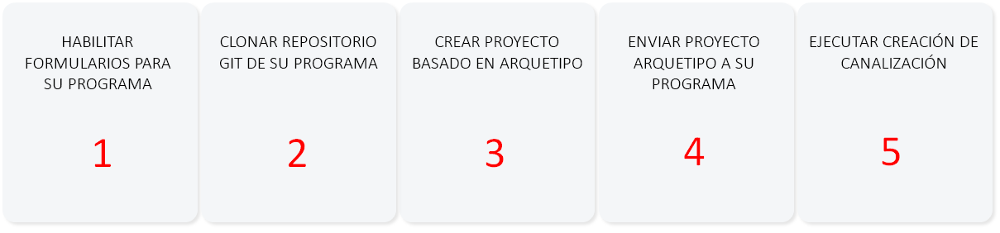
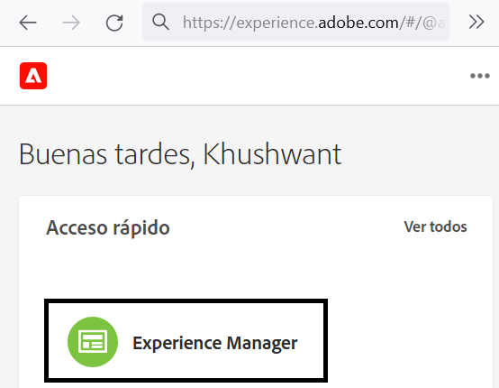
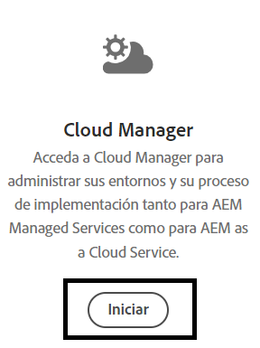
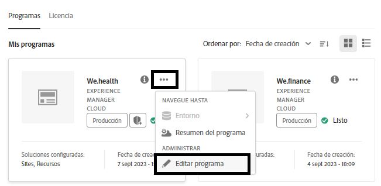
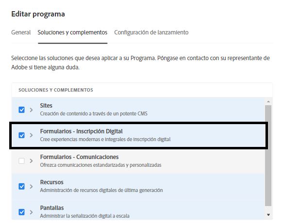
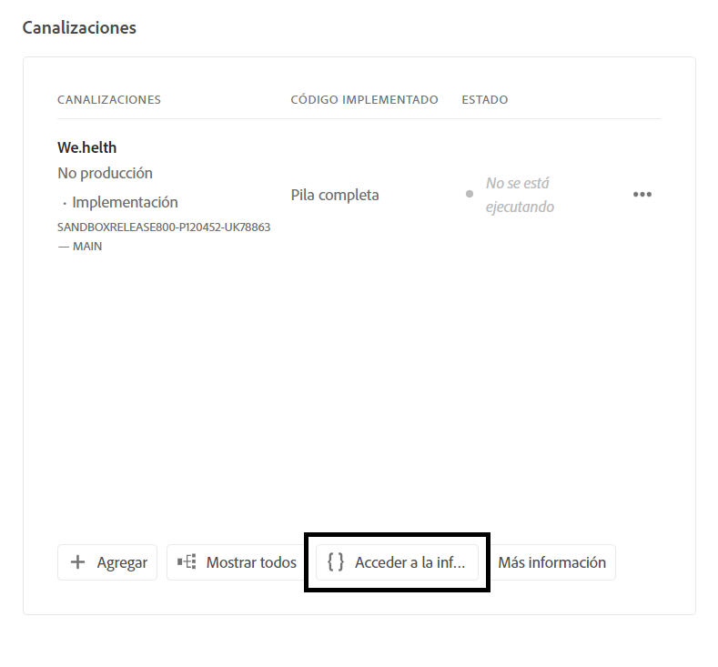
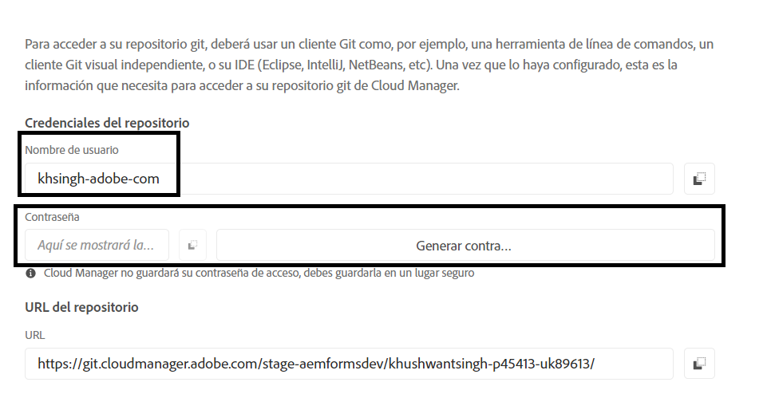
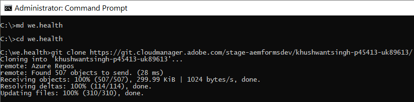
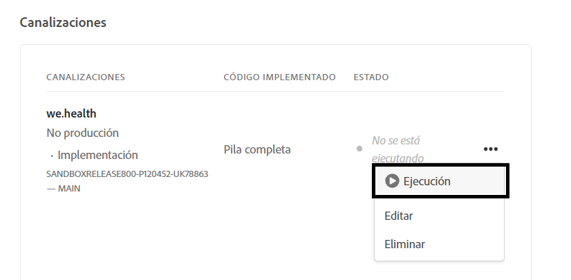

# Configurar el entorno de desarrollo para formularios adaptables sin encabezado en el Cloud Service

<span class="preview"> Este es un **TRABAJO EN CURSO** artículo.</span>


¿Está listo para crear y probar formularios adaptables sin encabezado en Cloud Service? Habilite Forms para su programa de Cloud Service y póngase en marcha.

## Antes de empezar

* Instalar [Última versión de Git](https://git-scm.com/downloads) en el equipo local. Si es nuevo en Git, consulte [Instalación de Git](https://git-scm.com/book/en/v2/Getting-Started-Installing-Git). El repositorio de Git se utiliza para insertar los formularios y el código personalizado desarrollados en el entorno de desarrollo local en el entorno de desarrollo de Cloud Service.

* Instalar [Node.js 16.13.0 o posterior](https://nodejs.org/es/download/) en el equipo local. Si no tiene experiencia previa con Node.js, consulte [Cómo instalar Node.js](https://nodejs.dev/en/learn/how-to-install-nodejs).

* AEM Cree un programa as a Cloud Service de: siga los pasos del 1 al 7 del [crear programa](https://experienceleague.adobe.com/docs/experience-manager-cloud-service/content/onboarding/demo-add-on/create-program.html?#create-program) para crear un programa para su organización.

* Activar [Canal de prelanzamiento para su programa de Cloud Service](https://experienceleague.adobe.com/docs/experience-manager-cloud-service/content/release-notes/prerelease.html?cloud-environments).

## Configurar flujo de trabajo

Para habilitar los formularios adaptables sin encabezado en la zona protegida as a Cloud Service de Forms, habilite `Forms - Digital enrolment` para su programa de AEM Cloud Service, cree un proyecto basado en Archetype 37 o posterior en su equipo local y envíelo a su entorno as a Cloud Service de Forms. El proceso completo es el siguiente:



### 1. Habilite Forms para su programa

<table style="table-layout:auto">
<tr>
  <td>
  1. Inicie sesión en <a href="https://experience.adobe.com/" > https://experience.adobe.com/ </a>  y seleccione la <b> Experience Manager </b> opción.
  </td>
  <td>
    <a href="https://experienceleague.adobe.com/docs/experience-manager-cloud-service/content/onboarding/demo-add-on/create-program.html?#create-program">
      
    </a>
    <br>
  </td>
</tr>
<tr>
  <td>
  2. Para el <b> Cloud Manager </b> , haga clic en <b> Lanzamiento. </b> Aparecerá una lista de programas para su organización.
  </td>
  <td>
    <a href="https://experienceleague.adobe.com/docs/experience-manager-cloud-service/content/onboarding/demo-add-on/create-program.html?#create-program">
      
    </a>
    <br>
  </td>
</tr>
<tr>
  <td>
    3. Para su programa, pulse el icono ... y seleccione <b> Editar programa </b> opción. Aparecerá un cuadro de diálogo. 
  </td>
  <td>
    <a href="https://experienceleague.adobe.com/docs/experience-manager-cloud-service/content/onboarding/demo-add-on/create-program.html?#create-program">
      
    </a>
    <br>
  </td>
</tr>
<tr>
  <td>
    4. En el cuadro de diálogo Editar programa, vaya al <b> Pestaña Soluciones y complementos </b>, seleccione la <b> Forms - Inscripción digital </b> y pulse en <b> actualizar </b>. 
  </td>
  <td>
    <a href="https://experienceleague.adobe.com/docs/experience-manager-cloud-service/content/onboarding/demo-add-on/create-program.html?#create-program">
      
    </a>
    <br>
  </td>
</tr>
</table>

### 2. Clone el repositorio Git del programa en el equipo local

AEM Cada programa as a Cloud Service tiene un repositorio de Git. Permite cargar código personalizado y recursos desde el equipo local al entorno de Cloud Service. Durante la configuración, utilizamos el repositorio Git para llevar el código relacionado con los formularios adaptables sin encabezado, las plantillas y otra información a su programa de Cloud Service desde su equipo local. Clonar el repositorio de Git del Cloud Service en el equipo local es el primer paso para llevar el código y el contenido personalizados del equipo local al Cloud Service.

>[!INFO]
>
> Siempre puede comprometerse con un repositorio Git sin clonarlo. Pero tiene sus propias peculiaridades. Así que estamos usando el enfoque de clonación en este documento.


Para clonar el repositorio, haga lo siguiente:

<table style="table-layout:fixed">
<tr>
  <td>
  1. En el cuadro de canalización del programa, pulse <b> Acceder a la info del repositorio. </b> Aparecerá un cuadro de diálogo con información del repositorio 
  </td>
  <td>
    <a href="https://experienceleague.adobe.com/docs/experience-manager-cloud-service/content/onboarding/demo-add-on/create-program.html?#create-program">
      
    </a>
    <br>
  </td>
</tr>
<tr>
  <td>
  2. Pulse <b> Generar contraseña </b> y copie el <b> URL del repositorio. </b> 
  </td>
  <td>
      
    <br>
  </td>
</tr>
<tr>
  <td>
    3. En el equipo local, abra el símbolo del sistema, cree una carpeta, ejecute el siguiente comando y proporcione las credenciales del repositorio, tal y como se solicita:
    </br>
    <code> git clone [Repository URL] </code> </br></br>
    Por ejemplo, </br> 
    <code> git clone https://git.cloudmanager.adobe.com/stage-aemformsdev/khushwantsingh-p45413-uk89613/ </code>

</br> Cuando se le pregunte, consiga la <b> Nombre de usuario</b> y <b>Contraseña</b> desde el <b>Información del repositorio</b> pantalla.
</td>
  <td>
     
  </td>
</tr>
</table>


### AEM 3. Crear un proyecto basado en el tipo de archivo de

El tipo de archivo del proyecto es una plantilla basada en Maven. Crea un proyecto mínimo basado en las prácticas recomendadas para empezar a utilizar formularios adaptables sin encabezado. También incluye la funcionalidad principal de formularios adaptables sin encabezado para Forms as a Cloud Service. Es obligatorio crear e implementar el tipo de archivo 37 o un proyecto basado en.
®®Según el sistema operativo, ejecute el comando de Maven para crear un proyecto as a Cloud Service de Experience Manager Forms. Utilice la versión 37 o posterior del tipo de archivo. Consulte [Documentación de tipo de archivo](https://experienceleague.adobe.com/docs/experience-manager-core-components/using/developing/archetype/overview.html?lang=es) para encontrar la última versión de Archetype.

+++ Microsoft® Windows

1. Abra el símbolo del sistema con privilegios administrativos (ejecute el símbolo del sistema o bash shell como administrador).
1. Ejecute el siguiente comando:

   ```shell
     mvn -B org.apache.maven.plugins:maven-archetype-plugin:3.2.1:generate ^
     -D archetypeGroupId=com.adobe.aem ^
     -D archetypeArtifactId=aem-project-archetype ^
     -D archetypeVersion=37 ^
     -D appTitle=myheadlessform ^
     -D appId=myheadlessform ^
     -D groupId=com.myheadlessform ^
     -D includeFormsenrollment="y" ^
     -D includeFormsheadless="y" 
   ```

Conjunto ™™™ * `appTitle` para definir el título y los grupos de componentes.
* Definir `appId` para definir los nombres de Maven artifactId, los componentes, la configuración, las carpetas de contenido y las bibliotecas de cliente.
* Definir `groupId` para definir el groupId de Maven y el paquete de origen de Java™.
* Utilice la opción `includeFormsenrollment=y` para incluir configuraciones, temáticas, plantillas, componentes principales y dependencias específicos para formularios, que son necesarios para crear formularios adaptables.
* Utilice el `includeFormsheadless=y` para incluir los componentes principales de Forms y las dependencias necesarias para incluir la funcionalidad de los formularios adaptables sin encabezado. Al habilitar esta opción, se incluyen las siguientes opciones:\
* El **Vacío con componentes principales** plantilla con [componentes principales](https://experienceleague.adobe.com/docs/experience-manager-core-components/using/introduction.html?lang=es).
* Un módulo de React de front-end, `ui.frontend.react.forms.af`. Le ayuda a procesar formularios adaptables sin encabezado en una aplicación de react.

+++®®


+++ Apple macOS o Linux®

1. Abra el terminal como usuario raíz. Permite ejecutar comandos con privilegios administrativos. También puede utilizar `sudo root` después de abrir la ventana de terminal para ejecutar comandos con privilegios administrativos.
1. Ejecute el siguiente comando:

   ```shell
     mvn -B org.apache.maven.plugins:maven-archetype-plugin:3.2.1:generate \
     -D archetypeGroupId=com.adobe.aem \
     -D archetypeArtifactId=aem-project-archetype \
     -D archetypeVersion=37 \
     -D appTitle=myheadlessform \
     -D appId=myheadlessform \
     -D groupId=com.myheadlessform \
     -D includeFormsenrollment="y" \
     -D includeFormsheadless="y"  
   ```

Conjunto ™™™ * `appTitle` para definir el título y los grupos de componentes.
* Definir `appId` para definir los nombres de Maven artifactId, los componentes, la configuración, las carpetas de contenido y las bibliotecas de cliente.
* Definir `groupId` para definir el groupId de Maven y el paquete de origen de Java™.
*  Utilice la opción `includeFormsenrollment=y` para incluir configuraciones, temáticas, plantillas, componentes principales y dependencias específicos para formularios, que son necesarios para crear formularios adaptables.
* Utilice el `includeFormsheadless=y` para incluir los componentes principales de Forms y las dependencias necesarias para incluir la funcionalidad de los formularios adaptables sin encabezado. Al habilitar esta opción, se incluyen las siguientes opciones:\
* El **Vacío con componentes principales** plantilla con [componentes principales](https://experienceleague.adobe.com/docs/experience-manager-core-components/using/introduction.html?lang=es).
* Un módulo de reacción de front-end, `ui.frontend.react.forms.af`. Le ayuda a procesar formularios adaptables sin encabezado en una aplicación de react.

+++

Al finalizar correctamente el comando, especifique una carpeta de proyecto con el nombre en la variable `appID` se ha creado. Por ejemplo, si utiliza `appID` con valor `myheadlessform`, una carpeta denominada `myheadlessform` se ha creado. Contiene el proyecto basado en el tipo de archivo.

### AEM 4. Envíe el proyecto basado en el tipo de archivo de a su entorno de Cloud Service

1. Reemplace el contenido del repositorio de Git por contenido de un proyecto basado en el tipo de archivo.

   >[!VIDEO](https://video.tv.adobe.com/v/3409809/)

1. Abra el símbolo del sistema, vaya a la carpeta Repositorio de Git y ejecute los siguientes comandos en el orden indicado para cargar el contenido reemplazado en el entorno de Cloud Service. También puede utilizar un editor visual en lugar de utilizar los siguientes comandos para insertar contenido en el repositorio del Cloud Service.

   ```
      git add .
      git commit
      git push origin
   ```

### 5. Ejecute la canalización de compilación para su programa


<table style="table-layout:auto">
<tr>
  <td>
  1. Inicie sesión en <a href="https://experience.adobe.com/" > https://experience.adobe.com/ </a>  y seleccione la <b> Experience Manager </b> opción.
  </td>
  <td>
    <a href="https://experienceleague.adobe.com/docs/experience-manager-cloud-service/content/onboarding/demo-add-on/create-program.html?#create-program">
      
    </a>
    <br>
  </td>
</tr>
<tr>
  <td>
  2. Para el <b> Cloud Manager </b> , haga clic en <b> Lanzamiento. </b> Aparecerá una lista de programas para su organización. Abra el programa. 
  </td>
  <td>
    <a href="https://experienceleague.adobe.com/docs/experience-manager-cloud-service/content/onboarding/demo-add-on/create-program.html?#create-program">
      
    </a>
    <br>
  </td>
</tr>
<tr>
  <td>
    3. Para la canalización, pulse el icono ... y seleccione <b> Ejecutar </b> opción. Si se le solicita que ejecute la canalización, pulse <b> Ejecutar </b> y espere a que se canalice <b> Estado </b>  para cambiar a <b> Completado </b>.  
  </td>
  <td>
    <a href="https://experienceleague.adobe.com/docs/experience-manager-cloud-service/content/onboarding/demo-add-on/create-program.html?#create-program">
      
    </a>
    <br>
  </td>
</tr>
</table>

Ahora, su entorno está listo para usar formularios adaptables sin encabezado. Ahora puede cargar la definición JSON de un formulario en el entorno de su Cloud Service, crear un formulario adaptable sin encabezado basado en él y utilizar el [getForm](https://opensource.adobe.com/aem-forms-af-runtime/api/#tag/Get-Form-Definition/operation/getForm) y otras API de REST para utilizar el formulario adaptable sin encabezado en su aplicación o servicio.
