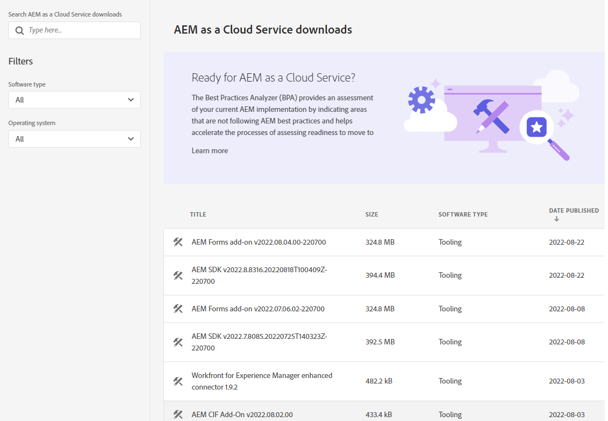
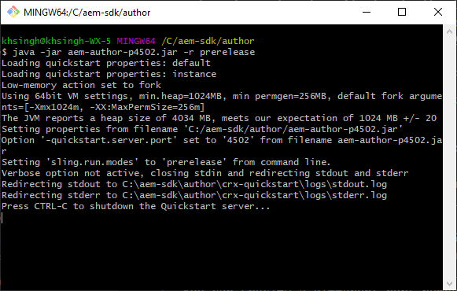

# Configuración de un entorno de desarrollo local {#headless-adaptive-forms-setup-development-environment}

Puede configurar un entorno de desarrollo local para crear y probar formularios adaptables sin encabezado en el equipo local. El entorno de desarrollo consiste en el SDK de AEM y el archivo de funciones de AEM Forms instalados en el SDK de AEM.
<!--
 After a Headless adaptive form or related assets are ready on the local development environment, you can deploy the Headless adaptive form application to your publishing environment. -- >

You require knowledge to build application using react, Git, and Maven to use Headless adaptive forms.

<!-- 

### Download the latest version of AEM as a Cloud Service SDK or Forms feature archive (AEM Forms add-on) from Software Distribution {#software-distribution}

To download the supported version of Adobe Experience Manager as a Cloud Service SDK or Forms feature archive (AEM Forms add-on):

1. Log in to [Software Distribution](https://experience.adobe.com/#/downloads) portal with your Adobe ID.

    >[!NOTE]
    >
    > Your Adobe Organization must be provisioned for AEM as a Cloud Service to download the AEM as a Cloud Service SDK.

1. Navigate to the **[!UICONTROL AEM as a Cloud Service]** tab.
1. Sort by published date in descending order.
1. Click on the latest Adobe Experience Manager as a Cloud Service SDK or Forms feature archive (AEM Forms add-on).
1. Review and accept the EULA. Tap the **[!UICONTROL Download]** button. -->

## Requisitos del sistema {#headless-adaptive-forms-system-requirements}

Para instalar el SDK de AEM, el equipo local debe cumplir estos requisitos mínimos:

* [Kit de desarrollo de Java 11](https://experience.adobe.com/#/downloads/content/software-distribution/en/general.html?1_group.propertyvalues.property=.%2Fjcr%3Acontent%2Fmetadata%2Fdc%3AsoftwareType&amp;1_group.propertyvalues.operation=equals&amp;1_group.propertyvalues.0_values=software-type%3Atooling&amp;fulltext=Oracle%7E+JDK%7E+11%7E&amp;orderby=%40jcr%3Acontent%2Fjcr%3AlastModified&amp;orderby.sort=desc&amp;layout=list&amp;p.offset=0&amp;p.limit=14)
* [Última versión de Git](https://git-scm.com/downloads). Si no tiene experiencia previa con Git, consulte [Instalación de Git](https://git-scm.com/book/en/v2/Getting-Started-Installing-Git).
* [Node.js 16.13.0 o posterior](https://nodejs.org/es/download/). Si no tiene experiencia previa con Node.js, consulte [Cómo instalar Node.js](https://nodejs.dev/en/learn/how-to-install-nodejs).
* [Maven 3.6 o posterior](https://maven.apache.org/download.cgi). Si no tiene experiencia previa con Maven, consulte [Instalación de Apache Maven](https://maven.apache.org/install.html?lang=es).

## Configurar el entorno de desarrollo {#headless-adaptive-forms-procedure-to-setup-development-environment}

Para configurar un nuevo entorno de desarrollo local y utilizarlo para desarrollar y probar formularios adaptables sin encabezado:

1. [Configurar el SDK de AEM as a Cloud Service](#setup-author-instance).
1. [Añadir el archivo de AEM Forms (complemento de AEM Forms as Cloud Service) al SDK de AEM](#add-forms-archive).

<!--

1. (Optional) [Add Forms-specific users to your local Author instance](#configure-users-and-permissions).
1. (Optional) Install [Adaptive forms builder extension for Microsoft Visual Studio Code](#microsoft-visual-studio-code-extension-for-headless-adaptive-forms). 

-->

### 1. Configurar el SDK de AEM as a Cloud Service {#setup-author-instance}

El SDK de AEM as a Cloud Service (SDK de AEM) proporciona a los desarrolladores una experiencia local para crear y probar formularios adaptables sin encabezado. Puede utilizar el SDK de AEM as a Cloud Service para crear y previsualizar formularios adaptables sin encabezado, lo que le permite realizar la mayoría de las validaciones relacionadas con el desarrollo localmente. Para configurar una instancia de autor local:

1. [Descargue](https://experience.adobe.com/#/downloads/content/software-distribution/es-es/aemcloud.html) el último [!DNL Adobe Experience Manager] SDK de as a Cloud Service. Utilice la columna Fecha de publicación para ordenar y localizar fácilmente el SDK más reciente.
Está en formato .zip. La versión compatible es aem-sdk-2022.7.8085.20220725T140323Z-220700.zip y posterior.

   


1. Extraiga el archivo .zip descargado en un directorio del equipo local.
1. Cree un directorio en el equipo local que sirva como ubicación de instalación para la instancia de autor. Por ejemplo, `~/aem-sdk/author`.
1. Copie el archivo .jar de los archivos SDK extraídos a la ubicación de instalación y cambie el nombre del archivo a `aem-author-p4502.jar`. La cadena `p4502` en el nombre de archivo especifica el número de puerto que se va a utilizar. También puede especificar un número de puerto diferente.

   >[!NOTE]
   >
   > No haga doble clic en el archivo .jar para iniciarlo. Esto da como resultado un [error](https://experienceleague.adobe.com/docs/experience-manager-learn/cloud-service/local-development-environment-set-up/aem-runtime.html?lang=es#troubleshooting-double-click).

1. Abra el símbolo del sistema:
   * En Windows, utilice la opción **Ejecutar como administrador** para abrir el símbolo del sistema en modo elevado.
   * En Linux, asegúrese de abrir la ventana de terminal como usuario raíz.

1. Vaya a la ubicación de instalación que contiene el archivo .jar copiado y ejecute el siguiente comando:

   `java -jar aem-author-p4502.jar -r prerelease`

   

   * El conmutador `-r prerelease` activa las funciones disponibles solo en los programas de versión preliminar y de lanzamiento limitado.
   * Puede utilizar `admin` como nombre de usuario y contraseña para el desarrollo local con el fin de reducir la carga cognitiva.

   Una vez iniciado AEM, se abre la página de inicio de sesión en el explorador web. También puede abrir la página de inicio de sesión de la instancia de SDK de AEM en la dirección de correo electrónico `http://localhost:<port>` en el explorador web. Por ejemplo, [http://localhost:4502](http://localhost:4502).

1. Inicie sesión en su instancia de autor. Pulse el icono , pulse Acerca de Adobe Experience Manager y asegúrese de que el número de versión incluya el sufijo Versión preliminar.

   

Si no ve el sufijo Versión preliminar, detenga el servidor, elimine `[AEM SDK installation]/crx-quickstart folder` y reinicie el archivo .jar del SDK de AEM con el conmutador `-r prerelease`. Para ver más opciones, consulte [Resolución de problemas](/help/troubleshooting.md).

### 2. Agregar el archivo de AEM Forms (complemento de AEM Forms Cloud Service) al SDK de AEM {#add-forms-archive}

El archivo de características de AEM Forms as a Cloud Service (complemento de AEM Forms Cloud Service) proporciona herramientas para crear formularios adaptables sin encabezado en un entorno de desarrollo local. Para instalar el archivo de características, haga lo siguiente:

1. Descargue y extraiga el último archivo de características [!DNL AEM Forms] (complemento de AEM Forms) en [Distribución de software](https://experience.adobe.com/#/downloads/content/software-distribution/en/aemcloud.html?fulltext=AEM*+Forms*+add*+on*&amp;orderby=%40jcr%3Acontent%2Fjcr%3AlastModified&amp;orderby.sort=desc&amp;layout=list&amp;p.offset=0&amp;p.limit=20). Utilice la columna Fecha de publicación para ordenar y localizar fácilmente el SDK más reciente. La versión compatible es aem-forms-addon-2022.07.06.02-220600 y posterior.

1. Navegue hasta el directorio crx-quickstart/install. Si la carpeta no existe, créela.
1. Detenga la instancia de SDK de AEM. Puede finalizar la ventana del símbolo del sistema que ejecuta la instancia del SDK de AEM para detener AEM.
1. Copie el [!DNL AEM Forms]archivo de características de complementos del archivo, `aem-forms-addon-<version>.far`, que se ha extraído en el paso 1 a la carpeta de instalación.
1. Utilice el siguiente comando para reiniciar la instancia del SDK de AEM:

   `java -jar aem-author-p4502.jar -r prerelease`

<!-- 

### 3. (Optional) Configure users and permissions {#configure-users-and-permissions}

Create seperate user accounts for Form Developer, Form Practitioner, and end users. These account help you test Headless adaptive forms for various types of users. To create a user account and add roles to the account:

1. Login to your AEM SDK instance.
1. Go to Tools > Security > Users and tap Create. The Create New User wizard opens.
1. In the details tab, specify an ID and Password. All other fields are optional. It is recommended to provide name and an email address.
1. In the Groups tab, search and select user-groups for a user depending on their role. The table below lists all types of users and pre-defined groups for each type of forms users based on their role:
  
    | User Type | AEM Group |
    |---|---|
    | Form developer | [!DNL forms-users] (AEM Forms Users), [!DNL template-authors], [!DNL workflow-users], [!DNL workflow-editors], and [!DNL fdm-authors]  |
    | Customer Experience Lead or UX Designer| [!DNL forms-users], [!DNL template-authors]|
    | AEM administrator | [!DNL aem-administrators], [!DNL fd-administrators] |
    | End user| When a user must log in to view and submit an Adaptive Form, add such users to [!DNL forms-users] group. </br> When no user authentication is required to access Adaptive Forms, do not assign any group to such users.|

<!-- ### 4. (Optional) Install Visual Studio Code extension for Headless adaptive forms {#microsoft-visual-studio-code-extension-for-headless-adaptive-forms}

You can use any IDE for developing Headless adaptive forms. Adobe provides an extension for Microsoft&reg;reg; Visual Studio Code to make it easier for you to navigate structure and develop Headless adaptive forms. The extension adds adaptive forms related IntelliSense capabilities and helps auto-complete Headless adaptive forms JSON syntax. It also adds a panel, titled Forms Tree, to help navigate structure of Headless adaptive form. To use the extension: 

1. Ensure [Microsoft Visual Studio Code 1.62.0 or later](https://code.visualstudio.com/docs/supporting/FAQ#_how-do-i-find-the-version) is installed. If you have an older version or no version installed, download the latest version from [Microsoft Website](https://code.visualstudio.com/docs/setup/setup-overview)
   >[!NOTE]
   >
   >
   > To use Visual Studio from command line on macOS, see [Launching from the command line](https://code.visualstudio.com/docs/setup/mac#_launching-from-the-command-line).

1. Download the [Adaptive forms builder extension](/help/assets/adaptive-form-builder-0.12.0.vsix).

1. Navigate the directory containing the *adaptive-form-builder-[version].vsix* file.

1. Run the following command or see [Install from a VSIX](https://code.visualstudio.com/docs/editor/extension-marketplace#_install-from-a-vsix) article for detailed instructions to install a Visual Studio Code extension from a VSIX file:

    `code -–install-extension adaptive-form-builder-[version].vsix`

    </br> Replace the [version] with actual version of the extension. For example, `code -–install-extension adaptive-form-builder-0.12.0.vsix`

    </br> 

    

<!-- ## Create and setup a react app

Adaptive forms renderer component is a react based component. It requires a react app to run and render a Headless adaptive form. To create and setup react app:

1. Open terminal in Visual Studio code and run the following command to create a react app and installs all related dependencies:

    ```shell
    npx create-react-app [react-app-name] --scripts-version 4.0.3 --template typescript
    ```

    Where [react-app-name] represents name of the project, script version is 4.0.3, and template of type typescript. For example, the following command creates a react app named *headless-forms-demo*.

    ```shell
    npx create-react-app headless-forms-demo --scripts-version 4.0.3 --template typescript
    ```

    It may take some time to create the react app and install all the dependencies. The command creates an empty react app with latest version of react and react-dom dependencies. It does not have any artifacts related to adaptive forms renderer component.

1. Adaptive forms renderer component is based on react spectrum and requires react 16.0.0 and react-dom 16.0.0. To install react 16.0.0 and related dependencies:
    1. Open the Visual Studio code terminal Window or command prompt.
    1. Navigate to the directory of react project.  
    1. Run the following command:

        ```shell
        npm install --save react@16.0.0 react-dom@16.14.0 -force
        ```

1. Run the following command to install adaptive forms renderer component related dependencies:

    ```shell
    npm i --save @aemforms/forms-super-component @aemforms/forms-react-core-components @aemforms/forms-super-component @adobe/react-spectrum @react/react-spectrum
    ```

<!-- 1. Install dependencies for adaptive forms renderer component. Packages for these dependencies are available in Adobe Artifactory. To authenticate with Adobe Artifactory and install dependencies for adaptive forms renderer component:

    1. Create environment variables ARTIFACTORY_USER and ARTIFACTORY_API_TOKEN. The ARTIFACTORY_USER stores Adobe LDAP username and ARTIFACTORY_API_TOKEN stores your [Adobe Artifactory token](https://wiki.corp.adobe.com/display/Artifactory/API+Keys)

    1. Run the following command to set NPM_TOKEN and NPM_EMAIL tokens:

        ```shell

        auth=$(curl -s -u${ARTIFACTORY_USER}:${ARTIFACTORY_API_TOKEN} https://artifactory.corp.adobe.com/artifactory/api/npm/auth)
        export NPM_TOKEN=$(echo "${auth}" | grep "_auth" | awk -F " " '{ print $3 }')
        export NPM_EMAIL=$(echo "${auth}" | grep "email" | awk -F " " '{ print $3 }')
        ```

        These tokens are required to communicated with Adobe Artifactory.

    1. Create a .npmrc file in the react project.

        

    1. Add the following code to the file:

        ```shell
        @aemforms:registry=https://artifactory.corp.adobe.com/artifactory/api/npm/npm-aem-release/
        @react:registry=https://artifactory.corp.adobe.com/artifactory/api/npm/npm-react-release/
        @quarry:registry=https://artifactory.corp.adobe.com/artifactory/api/npm/npm-adobe-release-local/
        //artifactory.corp.adobe.com/artifactory/api/npm/npm-adobe-release-loca/:_auth=${NPM_TOKEN}
        //artifactory.corp.adobe.com/artifactory/api/npm/npm-aem-release/:_auth=${NPM_TOKEN}
        //artifactory.corp.adobe.com/artifactory/api/npm/npm-react-release/:_auth=${NPM_TOKEN}
        _auth=${NPM_TOKEN}
        email=${NPM_EMAIL}
        always-auth=true
        ```

        It defines the antifactory repositories to use for Headless adaptive forms, react, and quarry related scope.
    1. Run the following command to install adaptive forms renderer component related dependencies:

    ```shell
    npm i --save @aemforms/crispr-react-bindings @aemforms/crispr-react-core-components @adobe/react-spectrum @react/react-spectrum
    ```
 
-->
El entorno de desarrollo local está listo. Puede continuar creando un formulario adaptable sin encabezado.
