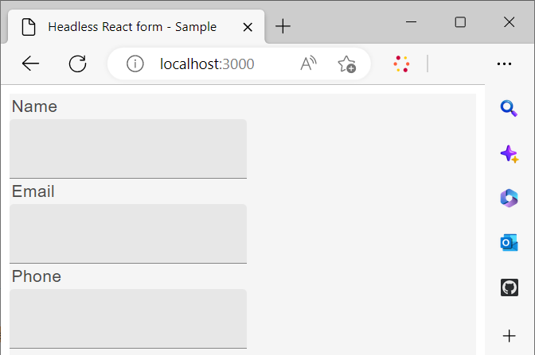

# Utilizar una biblioteca de React personalizada para procesar un formulario sin encabezado

Puede crear e implementar componentes personalizados para personalizar el aspecto y la funcionalidad (comportamiento) de los formularios adaptables sin encabezado según los requisitos y las directrices de su organización.

Estos componentes tienen dos propósitos principales: controlar el aspecto o el estilo de los campos de formulario y almacenar los datos recopilados a través de estos campos en la instancia del modelo de formulario. Si esto suena confuso, no se preocupe: exploraremos estos propósitos con más detalle en breve. Por ahora, vamos a centrarnos en los pasos iniciales de la creación de componentes personalizados, el procesamiento del formulario mediante estos componentes y la utilización de eventos para guardar y enviar datos a un extremo REST.

En este tutorial, los componentes de la interfaz de usuario de Google Material se emplean para mostrar cómo procesar un formulario adaptable sin encabezado mediante componentes React personalizados. Sin embargo, no está limitado a esta biblioteca y es libre de utilizar cualquier biblioteca de componentes de React o desarrollar sus propios componentes personalizados.

Al concluir este artículo, la _Contáctenos._ formulario creado en [Crear y publicar un formulario sin encabezado mediante Starter Kit](create-and-publish-a-headless-form.md) Este artículo se transforma en lo siguiente:


Los pasos principales involucrados en el uso de los componentes de la interfaz de usuario de Google Material para procesar un formulario son:


## 1. Instale la interfaz de usuario de Google Material

De forma predeterminada, el Starter Kit utiliza [Espectro de Adobe](https://spectrum.adobe.com/) componentes. Vamos a ponerlo en uso [IU de materiales de Google](https://mui.com/):

1. Asegúrese de que el kit de arranque no está en funcionamiento. Para detener el Starter Kit, abra el terminal y vaya al **react-starter-kit-aem-headless-forms** y pulse Ctrl-C (es lo mismo en Windows, Mac y Linux).

   No intente cerrar el terminal. El cierre del terminal no detiene el kit de arranque.

1. Ejecute el siguiente comando:

```shell
    
    npm install @mui/material @emotion/react @emotion/styled --force
    
```

Instala las bibliotecas npm de la interfaz de usuario de Google Material y las añade a las dependencias de los Starter Kits. Ahora puede utilizar los componentes de la interfaz de usuario de Material para procesar componentes de formulario.


## 2. Crear componentes React personalizados

Vamos a crear un componente personalizado que reemplace el predeterminado [entrada de texto](https://spectrum.adobe.com/page/text-field/) componente con [Campo de texto de IU de Google Material](https://mui.com/material-ui/react-text-field/) componente.

Se requiere un componente independiente para cada tipo de componente ([fieldType](https://opensource.adobe.com/aem-forms-af-runtime/storybook/?path=/story/reference-json-properties-fieldtype--text-input) o :type) utilizados en una definición de formulario sin encabezado. Por ejemplo, en el formulario Contáctenos que creó en la sección anterior, los campos Nombre, Correo electrónico y Teléfono son del tipo `text-input` ([fieldType: &quot;text-input&quot;](https://opensource.adobe.com/aem-forms-af-runtime/storybook/?path=/docs/adaptive-form-components-text-input-field--def)) y el campo de mensaje es del tipo `multiline-input` ([&quot;fieldType&quot;: &quot;multiline-input&quot;](https://opensource.adobe.com/aem-forms-af-runtime/storybook/?path=/docs/reference-json-properties-fieldtype--multiline-input)).


Vamos a crear un componente personalizado para superponer todos los campos de formulario que utilizan la variable [fieldType: &quot;text-input&quot;](https://opensource.adobe.com/aem-forms-af-runtime/storybook/?path=/docs/adaptive-form-components-text-input-field--def) propiedad con [Campo de texto de IU de material](https://mui.com/material-ui/react-text-field/) componente.


Para crear el componente personalizado y asignar el componente personalizado con la variable [fieldType](https://opensource.adobe.com/aem-forms-af-runtime/storybook/?path=/docs/adaptive-form-components-text-input-field--def) propiedad :

1. Abra el **react-starter-kit-aem-headless-forms** en un editor de código y vaya a `\react-starter-kit-aem-headless-forms\src\components`.


1. Cree una copia del **regulador** o **richtext** y cambie el nombre de la carpeta copiada a **materialtextfield**. Slider y richtext son dos componentes personalizados de ejemplo disponibles en la aplicación de inicio. Puede utilizarlas para crear sus propios componentes personalizados.

   

1. Abra el `\react-starter-kit-aem-headless-forms\src\components\materialtextfield\index.tsx` y reemplace el código existente por el siguiente código. Este código devuelve y procesa un [Campo de texto de IU de Google Material](https://mui.com/material-ui/react-text-field/) componente.

```JavaScript
 
     import React from 'react';
     import {useRuleEngine} from '@aemforms/af-react-renderer';
     import {FieldJson, State} from '@aemforms/af-core';
     import { TextField } from '@mui/material';
     import Box from '@mui/material/Box';
     import { richTextString } from '@aemforms/af-react-components';
     import Typography from '@mui/material/Typography';


     const MaterialtextField = function (props: State<FieldJson>) {

         const [state, handlers] = useRuleEngine(props);

         return(

         <Box>
             <Typography component="legend">{state.visible ? richTextString(state?.label?.value): ""} </Typography>
             <TextField variant="filled"/>
         </Box>

         )
     }

     export default MaterialtextField;
```


El `state.visible` la pieza comprueba si el componente está configurado para ser visible. Si es así, la etiqueta del campo se recupera y se muestra mediante `richTextString(state?.label?.value)`.


Su componente personalizado `materialtextfield` está listo. Vamos a configurar este componente personalizado para reemplazar todas las instancias de  [fieldType: &quot;text-input&quot;](https://opensource.adobe.com/aem-forms-af-runtime/storybook/?path=/docs/adaptive-form-components-text-input-field--def) con el campo de texto de la IU de Google Material.

## 3. Asignar un componente personalizado con campos de formulario sin encabezado

El proceso de utilizar componentes de una biblioteca de terceros para procesar campos de formulario se conoce como asignación. Debe asignar cada ([fieldType](https://opensource.adobe.com/aem-forms-af-runtime/storybook/?path=/story/reference-json-properties-fieldtype--text-input)) al componente correspondiente de la biblioteca de terceros.

Toda la información relacionada con la asignación se añade a `mappings.ts` archivo. El `...mappings` en el campo `mappings.ts` hace referencia a las asignaciones predeterminadas, que se superponen a la variable ([fieldType](https://opensource.adobe.com/aem-forms-af-runtime/storybook/?path=/story/reference-json-properties-fieldtype--text-input) o :type) con [Espectro de Adobe](https://spectrum.adobe.com/page/text-field/) componentes.

Para añadir la asignación para  `materialtextfield` componente, creado en el último paso:

1. Abra el `mappings.ts` archivo.

1. Añada la siguiente instrucción import para incluir el `materialtextfield` al componente de `mappings.ts` archivo:


   ```JavaScript
       import MaterialtextField from "../components/materialtextfield";
   ```

1. Añada la siguiente instrucción para asignar el `text-input` con el componente materialtextfield.


   ```JavaScript
       "text-input": MaterialtextField
   ```

   El código final del archivo tiene el siguiente aspecto:

   ```JavaScript
         import { mappings } from "@aemforms/af-react-components";
         import MaterialtextField from "../components/materialtextfield";
   
   
         const customMappings: any = {
           ...mappings,
           "text-input": MaterialtextField
        };
        export default customMappings;
   ```

1. Guarde y ejecute la aplicación. Los tres primeros campos del formulario se representan con [Campo de texto de IU de Google Material](https://mui.com/material-ui/react-text-field/):

   


   Del mismo modo, puede crear componentes personalizados para los campos de mensaje (&quot;fieldType&quot;: &quot;multiline-input&quot;) y clasificación del servicio (&quot;fieldType&quot;:&quot;number-input&quot;). Puede clonar el siguiente repositorio Git para los componentes personalizados del mensaje y clasificar los campos de servicio:

   [https://github.com/singhkh/react-starter-kit-aem-headless-forms](https://github.com/singhkh/react-starter-kit-aem-headless-forms)

## Siguiente paso

Ha procesado correctamente el formulario con componentes personalizados que utilizan la interfaz de usuario de Google Material. ¿Ha intentado enviar el formulario haciendo clic en el botón Enviar (asignado con el componente de interfaz de usuario de Google Material correspondiente)? Si no, adelante y pruébelo.

¿El formulario envía los datos a alguna fuente de datos? No? No se preocupe. Esto se debe a que el formulario no está configurado para comunicarse con la biblioteca de tiempo de ejecución.

¿Cómo puede configurar el formulario para que se comunique con él? Tenemos un artículo próximamente que explicará todo en detalle. ¡Manténgase al pendiente!
